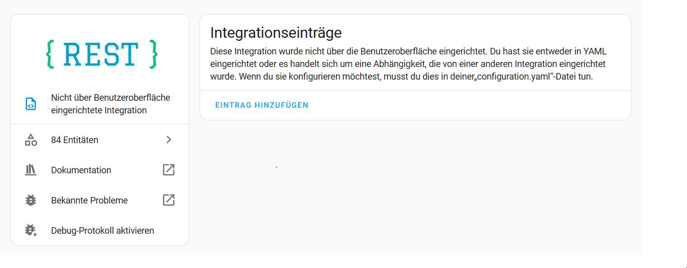
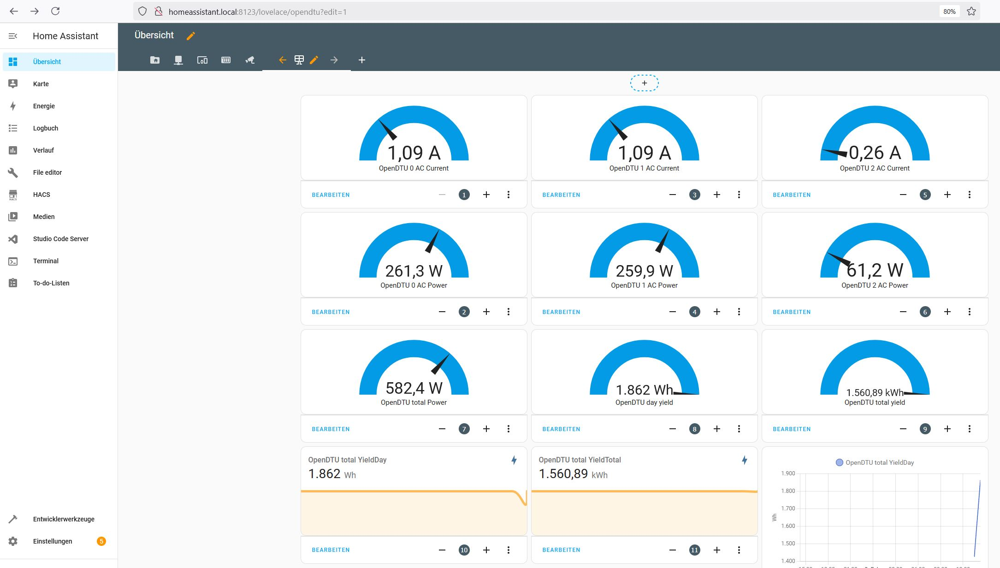
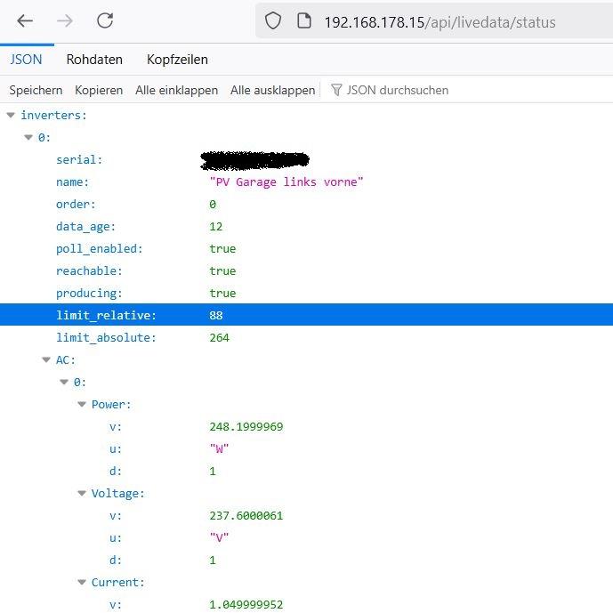

# OpenDTU Screenshots
Here are some unsorted screenshots as example.

---

You need to install the REST integration, which should look like this:

---

Some visualisation added:

---

The direct call (without Home Assistant) to your OpenDTU should show something like this:

Btw: The "limit_relative" shown here is 88%, which ist 264 Watt.
In germany you are allowed 800 Watt at all, so 3*264=792 is below 800 Watt.
You could set this limit using OpenDTU, but I did not include this into the integration currently.

